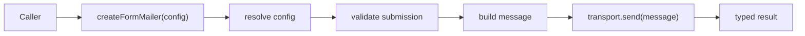

# Form Mailer Architecture

## Purpose

`form-mailer` is a lightweight, embeddable Node.js package for turning validated form submissions into email messages.

It is designed to stay:

- framework-agnostic
- TypeScript-first
- security-conscious by default
- dependency-light
- easy to embed in API routes, backend services, and serverless handlers

It is not intended to become:

- a hosted mail service
- an SMTP relay
- a full mail server
- a newsletter platform
- a SaaS product

## Product Intent

The package should make form-to-email delivery feel boring in the best possible way:

1. the caller supplies a submission and configuration
2. the library validates and sanitizes the submission
3. the library assembles a message
4. the configured transport delivers the email
5. the caller receives a typed success or failure result

The design favors:

- simplicity over abstraction
- predictable behavior over flexible-but-implicit behavior
- secure defaults over maximum configurability
- small surface area over broad feature coverage

## Architecture Overview

The implementation is organized into small modules:

- `src/index.ts` exposes the public API
- `src/config.ts` loads configuration and selects transport
- `src/config-parser.ts` parses the minimal YAML / record shape
- `src/validation.ts` validates submissions and resolves message data
- `src/mail.ts` assembles the outbound message
- `src/smtp.ts` sends the message over SMTP
- `src/errors.ts` creates the package error type
- `src/types.ts` defines the public TypeScript contracts

## Public Surface

The package root exports the supported entrypoints only:

- `createFormMailer`
- `createSmtpTransport`
- `loadConfigFromEnv`
- `loadConfigFromFile`
- `createFormMailerError`
- `isFormMailerError`

It also exports the public TypeScript types used by those entrypoints.

The main runtime object returned by `createFormMailer(config)` exposes:

- `validate(submission)`
- `send(submission)`

## Runtime Flow

### 1. Create the mailer

`createFormMailer(config)` resolves the supplied configuration, selects a transport, and returns a mailer instance.

If the caller supplied a custom transport, that transport is used directly.

If the caller supplied SMTP config, the package creates an SMTP transport.

If neither transport nor SMTP config is available, the package fails with a `config_error`.

### 2. Validate the submission

`validate(submission)` checks the submission before any network work begins.

Current validation rules include:

- email address format checking
- required field checks
- honeypot field detection
- origin allowlist enforcement
- payload size limits

Validation returns a structured result rather than throwing for expected user-input problems.

### 3. Build the message

`buildMailMessage()` creates the outbound email content from the validated submission and resolved config.

The message builder:

- formats sender and recipient addresses
- resolves subject and reply-to values
- emits plain text content
- emits multipart HTML content when useful

Header values are sanitized to reduce the risk of header injection.

### 4. Send through transport

The transport interface is intentionally small:

- `send(message): Promise<TransportSendResult>`

This keeps the package open to custom transports without turning the core API into a transport framework.

## Configuration Architecture

Configuration can come from three places:

1. inline code
2. environment variables
3. a config file

### Config discovery

The loader resolves configuration in this order:

1. use `FORM_MAILER_CONFIG_PATH` when present
2. otherwise use `FORM_MAILER_CONFIG_FILE` when present
3. otherwise look for `configs.yaml` in the deployment root
4. otherwise accept `config.yaml` as a compatibility fallback
5. otherwise build config from environment variables

The deployment root is the current process working directory in the Node.js runtime.

This means a deployment can use either:

- a `configs.yaml` file at the root of the deployed app
- a full path to a mounted config file via environment variable

### Env overrides

When a config file is loaded, environment variables override selected settings.

That keeps file-based deployment friendly while still allowing runtime-specific adjustments for container and serverless deployments.

### Minimal YAML parser

The YAML support is intentionally small.

It is meant for predictable deployment config, not for supporting every YAML feature.

The parser is limited to the shapes needed by the package configuration model.

## Validation and Security

Security checks happen before transport work begins.

The package protects against:

- malformed email addresses
- oversized submissions
- honeypot-triggered bot traffic
- invalid or disallowed origins
- header injection via newline characters in header-bearing fields

Additional design constraints:

- errors should not leak transport internals unnecessarily
- user-facing validation failures should be typed and structured
- defaults should be safe enough for small apps and serverless handlers

The default honeypot field name is `website` when one is not supplied.

## SMTP Transport

The SMTP transport is implemented directly with Node socket primitives.

This keeps the package dependency-light and gives the core package control over the SMTP handshake.

Supported transport behavior includes:

- plain TCP connections
- implicit TLS
- STARTTLS upgrade flow
- username/password authentication
- dot-stuffing for message bodies

Transport failures are surfaced as `smtp_error` or `transport_error` depending on where the failure occurs.

The SMTP layer is meant to work with common providers without introducing provider-specific abstractions.

## Packaging Boundaries

The npm package is intentionally lean.

The publish surface currently includes:

- runtime output
- the root `README.md`

It excludes:

- planning docs
- contributor instructions
- source-only development files

The root package export surface is curated rather than re-exporting every internal helper.

## Documentation Model

Documentation is split by purpose:

- root `README.md` as a short landing page
- `./docs` for Diátaxis-oriented user documentation
- `PLAN.md` for living discovery and implementation notes
- `ARCHITECTURE.md` for the committed design reference

The documentation hierarchy should make it easy to find:

- first-time setup
- task-oriented guidance
- API reference
- design rationale

## Architectural Invariants

- Node.js is the primary runtime target.
- The package handles email delivery only.
- The package does not embed a queueing layer or hosted mail service behavior.
- Public APIs stay small and explicit.
- Validation and sanitization happen before transport work begins.
- The publish surface stays lean.
- End-user documentation lives in `./docs`.
